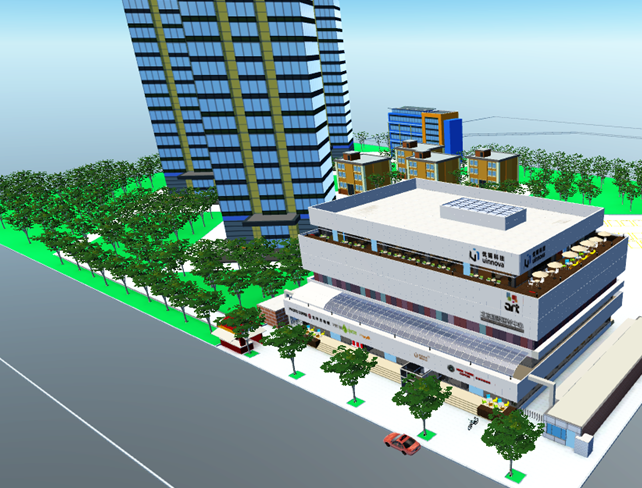
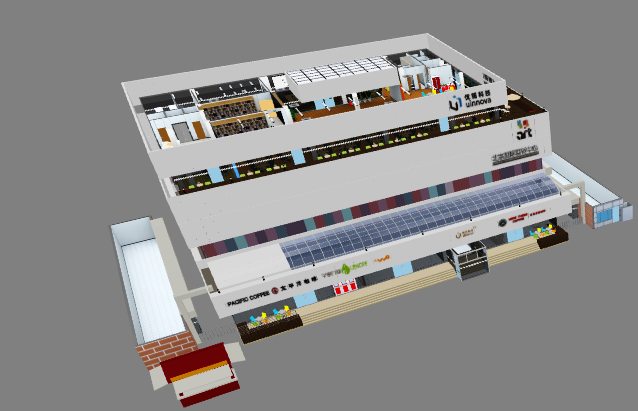
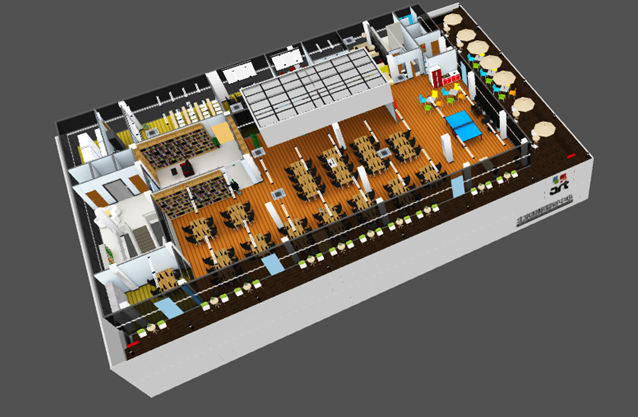
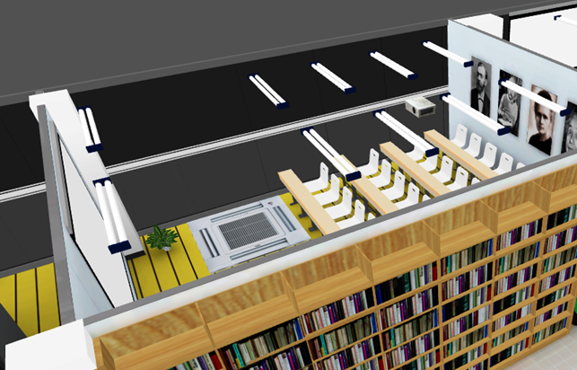

*********************
Concept Guide
*********************

model and Scene
==================

There are two basic and import concepts in Momoda: model and scene.

Model
^^^^^^^^^^^^

Model is *polygon representation* of object. 3D object could presents something from real world, concept or just your imagination. 

Model in Momoda shares the same of idea of 3D object in general, those 3D object could be organized and put into 3D scene like Lego.

Momoda also provides ‘official’ model library and could be used for free during 3D scene creation. User could also leverage uinnova’s profession service to create customized models. Besides, Momoda also provide a 3DSMax plugin which could upload 3D object created in 3DSMax to Momoda’s model library, and user could create and use their own model using this plugin, which make Momoda very extensible in term of model creation.

|

Scene
^^^^^^^^^^^^
Scene this one of the basic concept in Momoda. By use momoda’s free drawing studio, user can place , combine and layout 3D models/objects into a scene in drag and drop fashion. Typical scene could be campus, a factory, a harbor, and any another things you may think of. We call them “Momoda Scene”.

Momoda scene are stored in Momoda Cloud, which could be opened by own later on for editing, preview, or API debugging. Momoda scene can also be download and running locally as “Momoda Offline Edition” (may need purchase license issued by uinnova inc.).

|

Model Library
==================

There are three common objects in right navigation bar of momoda studio: model, texture and function.

- **Model**

Objects like building, car, people, desk, etc. User could also upload their custom objects through Momoda 3DSMax plugin.

- **Texture**

Textures to cover the surface of object, also supports use custom texture upload by user.

- **Function**

Effects such as fire, rain, flash, or assistant function such as drawing line, pipeline, or text. Function are system build-in and do not supports user upload at this time.

|

Scene Levels
=================

There are four level in Momoda scene: campus, building, stories and rooms.

|

- **Campus**

Upmost level of a scene.

- **Building**

Buildings (do not includes building facade)

- **Stories**

- **Room**

|

API Developement
===================

Momoda supports online development via **uBuilder API developing web page**. 

|

Create New API Project
^^^^^^^^^^^^^^^^^^^^^^^

There a two pane in developing web page, left pane is for script editing, right pane is for running scripts in 3D scene. To begin a new API development project, visit the  uBuilder API developing web page, input the ID of target 3D  scene, then click ``New`` button.

Deploy API Project to Scene
^^^^^^^^^^^^^^^^^^^^^^^^^^^^
To includes API script into your own scene, simply copy all the script source code and paste to the text box of  ``My Projects`` —> ``Target Scene`` —> ``Configure Scene``. 

|

Keyboard Shortcuts
^^^^^^^^^^^^^^^^^^^

Below are keyboard shortcuts in *uBuilder API debug page*:

- ``Ctrl+Enter`` Run Script
- ``Ctrl+R`` Reset Scene 
- ``Ctrl+/``  Comment/Uncomment source code

|

API Namespace
^^^^^^^^^^^^^^

uBuilder API functions are grouped in following namespaces:

.. csv-table::
    :header: Namespace, Description
    :widths: 5, 20

    camera, camera control
    object, "create, search or modify objects in 3D scene"
    gui, "manage user interface in 3D scene"
    BaseObject, "control existing objects"
    ScriptObject, "associate scripts on existing object"
    util, "common functions"
    input, keyboard and mouse events
    console, management console

|

